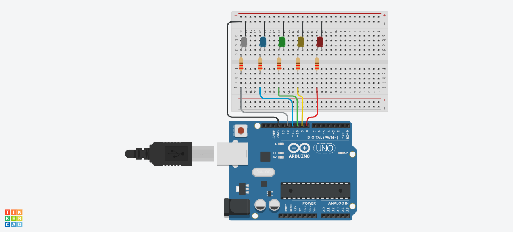

# LED Control Using Hand Gesture

Proyek ini memungkinkan pengguna mengontrol lima buah LED menggunakan gesture tangan. Sistem menggunakan **MediaPipe** untuk mendeteksi jari yang terbuka, lalu mengirim data ke Arduino via serial untuk mengontrol LED.

## 🎯 Fitur

- Deteksi 5 jari tangan (Thumb, Index, Middle, Ring, Pinky)
- Kontrol 5 LED secara individual berdasarkan posisi jari
- Integrasi Python dan Arduino melalui komunikasi serial

## 🛠️ Teknologi yang Digunakan

- **Python**
  - OpenCV
  - Mediapipe
  - PySerial
- **Arduino**
  - Board Arduino
  - LED & resistor (5 set)
  - Breadboard & kabel jumper

## 📷 Wiring

Gambar wiring akan ditambahkan di sini:




## 📁 Struktur Proyek

```
├── main.py                  # Script Python: deteksi gesture dan kirim ke Arduino
├── led_control.ino          # Program Arduino: kontrol LED berdasarkan data
├── requirements.txt         # Daftar dependensi Python
└── README.md
```

## 🚀 Cara Menjalankan

### 1. Upload Program ke Arduino

- Buka `led_control.ino` di Arduino IDE
- Sambungkan Arduino ke PC
- Pilih board dan port yang sesuai
- Upload ke board

Arduino akan menunggu 5 byte dari serial untuk mengontrol 5 LED pada pin 8–12.

### 2. Jalankan Script Python

- Pastikan Python 3 sudah terinstall
- Install library yang dibutuhkan:
  ```bash
  pip install -r requirements.txt
  ```
- Jalankan:
  ```bash
  python gesture_control.py
  ```

> Pastikan port serial di `main.py` sudah sesuai dengan port Arduino kamu, misalnya `'COM6'` di Windows atau `'/dev/ttyUSB0'` di Linux.

### 3. Kontrol dengan Gesture

- Tampilkan tangan di depan webcam
- Sistem akan mendeteksi jari yang terbuka dan menyalakan LED yang sesuai

## 🧐 Cara Kerja

- Jari terdeteksi → dibuat dalam bentuk array: `[Thumb, Index, Middle, Ring, Pinky]` (0 = tertutup, 1 = terbuka)
- Array dikirim via serial sebagai 5 byte: `b'\x01\x01\x00\x00\x01'`
- Arduino membaca tiap byte dan menyalakan LED di pin 8–12 berdasarkan nilai 0 atau 1

## 🧪 Contoh Output Konsol

```
Fingers State: [1, 1, 0, 0, 1]
```

LED thumb, index, dan pinky akan menyala.

## ✅ requirements.txt

```
opencv-python
mediapipe
pyserial
```

## 📄 Lisensi

Proyek ini menggunakan lisensi [MIT](LICENSE).

